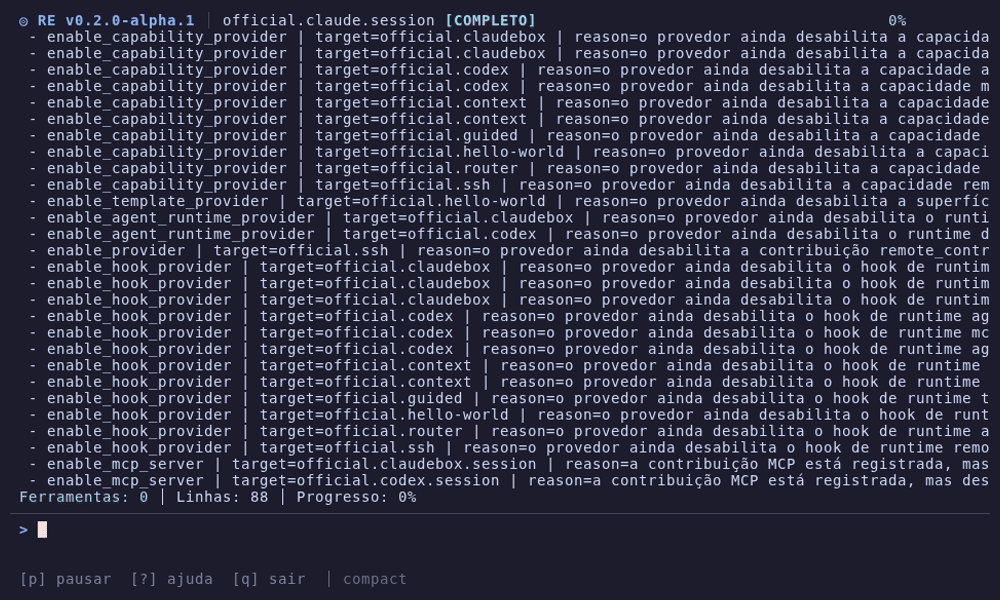

# Ralph Engine

[](https://github.com/diegorodrigo90/ralph-engine/actions/workflows/ci.yml)
[](https://sonarcloud.io/project/overview?id=ralph-engine_ralph-engine)
[](https://sonarcloud.io/project/overview?id=ralph-engine_ralph-engine)
[](https://github.com/diegorodrigo90/ralph-engine/releases)
[](rust-toolchain.toml)
[](LICENSE)

**The open-source runtime for agentic coding workflows.**

Ralph Engine orchestrates AI coding agents with a plugin-first Rust CLI. It provides a TUI dashboard, typed plugin contracts, runtime checks, MCP servers, and quality gates — for any agent.

```
      ╭───╮ ●
    ╭╯     ╰╮    Ralph Engine
    │  ◉   │    Autonomous AI Dev Loop
    ╰╮     ╭╯
  ●  ╰───╯
```

- Website: https://ralphengine.com
- Docs: https://ralphengine.com/docs/
- Plugins: https://ralphengine.com/plugins/

## Features

### Autonomous Dev Loop

Run `ralph-engine run` and it picks the next work item, launches an AI agent, and repeats — fully autonomous with a real-time TUI dashboard.

```bash
ralph-engine run              # Autonomous loop with TUI
ralph-engine run 5.3          # Execute specific work item
ralph-engine run --no-tui 5.3 # Headless mode (CI, pipes)
ralph-engine run --list       # List available work items
ralph-engine run plan 5.3     # Dry-run preview
```

### TUI Dashboard

<p align="center">
  
</p>

Real-time terminal dashboard powered by ratatui:

- **Responsive layout**: adapts to terminal width (compact / standard / wide)
- **Live agent activity**: stream-json events displayed as they arrive
- **Plugin panels**: auto-discovered sidebar panels from enabled plugins
- **Pause/Resume**: press `p` to send SIGSTOP to the agent, `p` again to resume
- **Quit confirmation**: press `q` then `y` to exit safely
- **Agent-agnostic**: works with Claude, Codex, or any streaming agent

### Plugin-First Architecture

10 official plugins, extensible by community:

- **Agent runtimes**: Claude, ClaudeBox, Codex
- **Workflow**: BMAD (work item resolution, prompt assembly)
- **Quality**: TDD-Strict (test-driven development enforcement)
- **Data**: Findings (feedback loop), GitHub (repository context)
- **Infrastructure**: SSH, MCP server contributions

```bash
npx create-ralph-engine-plugin my-plugin  # Scaffold a new plugin
ralph-engine install acme/jira-suite      # Install community plugins
ralph-engine plugins list                 # List enabled plugins
```

### Runtime Checks & Quality Gates

```bash
ralph-engine doctor           # Validate project health
ralph-engine checks run       # Execute plugin checks
ralph-engine agents launch    # Probe agent readiness
ralph-engine mcp launch       # Verify MCP server availability
```

### Works With Any Agent

Ralph Engine is agent-agnostic. It works with:

- **Claude Code** — via `-p` mode with `--output-format stream-json`
- **Codex** — via `codex exec --json`
- **Any agent** — that outputs stream-json to stdout

### How Agent Integration Works

Ralph Engine is an **orchestrator**, not a wrapper or proxy. It does not access, store, or manage authentication credentials for any agent. Each agent plugin launches the agent's own CLI binary as a subprocess — the agent handles its own authentication, billing, and API communication independently.

Ralph Engine does not intercept API calls, modify agent traffic, or relay requests through its own servers. It reads the agent's stdout stream to display progress in the TUI dashboard, and that is the extent of the integration.

This project is not affiliated with, endorsed by, or sponsored by Anthropic, OpenAI, Google, or any other AI provider. Agent names and trademarks belong to their respective owners.

### Bilingual (EN + PT-BR)

CLI, docs, and site are fully bilingual. The locale is auto-detected from your system or set explicitly:

```bash
ralph-engine --locale pt-br doctor
RALPH_ENGINE_LOCALE=pt-br ralph-engine run
```

## Install

```bash
# From source (recommended during alpha)
cargo install ralph-engine

# Or clone and build
git clone https://github.com/diegorodrigo90/ralph-engine.git
cd ralph-engine
cargo install --path core/crates/re-cli
```

## Quick Start

```bash
ralph-engine init             # Interactive project setup
ralph-engine doctor           # Check everything is ready
ralph-engine run              # Start the autonomous loop
```

## Repository Layout

```
core/crates/
├── re-cli/       CLI and command routing
├── re-tui/       TUI dashboard (ratatui)
├── re-core/      Shared runtime foundations
├── re-config/    Typed configuration contracts
├── re-plugin/    Plugin trait system
├── re-mcp/       MCP server discovery
├── re-official/  Official plugin registry
└── re-build-utils/ Build-time locale generation

plugins/official/  13 official plugins (Rust)
site/              Astro + Starlight docs (EN + PT-BR)
tools/             Plugin scaffolder (npx)
scripts/           Validation, release, CI
```

## Status

Alpha (`v0.2.0-alpha.1`). Core runtime is functional with 994 tests, 72 Golden Rules, 13 official plugins, and 11 themes via ratatui-themekit. TUI dashboard with zone_hint panels, autonomous loop, and guided mode are implemented. Release pipeline (npm, Homebrew) is gated pending final validation.

## License

MIT
